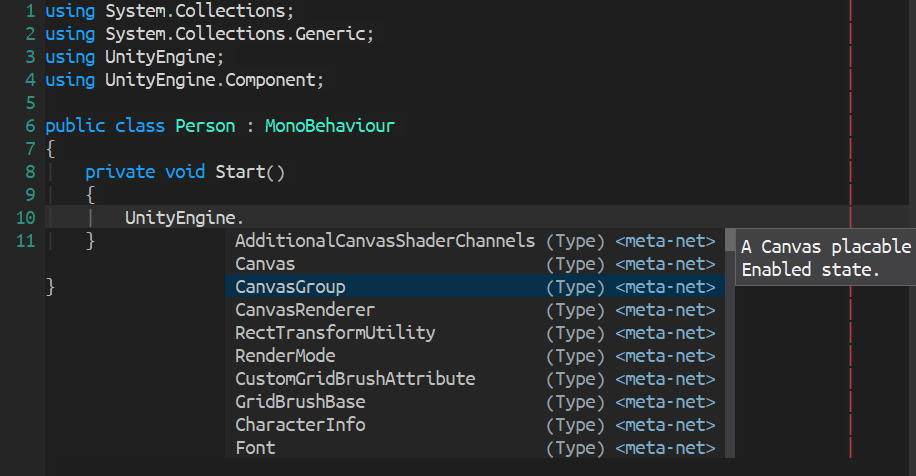

[](https://www.gnu.org/licenses/gpl-3.0)
[](https://celpa.conao3.com/#/company-meta-net)
[](https://jcs-emacs.github.io/jcs-elpa/#/company-meta-net)

# company-meta-net
> Company completion for C# project using meta-net


<p align="center">
  
</p>

## :floppy_disk: Quickstart

```el
(use-package company-meta-net
  :ensure t
  :hook (csharp-mode . (lambda ()
                         (add-to-list 'company-backends 'company-meta-net))))
```

## :hammer: Configurations

#### `company-meta-net-active-modes`

Major modes that allow completion.

#### `company-meta-net-display-annotation`

Display type annotation in company-mode's annotation command.

#### `company-meta-net-display-document`

Display document in company-mode's doc-buffer command.

## Contribute

[](http://makeapullrequest.com)
[](https://github.com/bbatsov/emacs-lisp-style-guide)

If you would like to contribute to this project, you may either
clone and make pull requests to this repository. Or you can
clone the project and establish your own branch of this tool.
Any methods are welcome!
